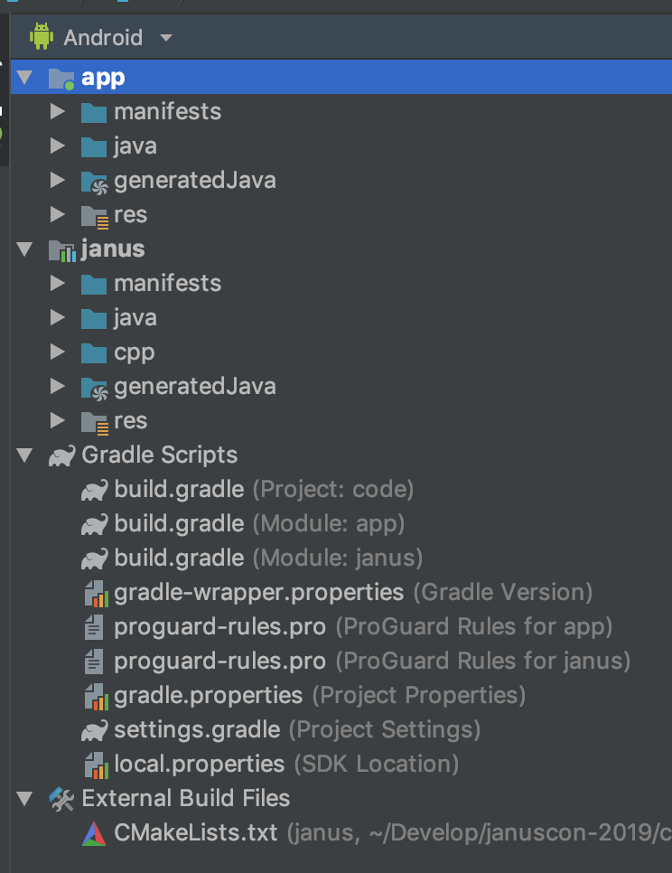

<div align="center" style="text-align:center">
  
  <h1>Janus Client SDK</h1>

  <h4>The <a href="https://github.com/meetecho/janus-gateway">Janus Gateway</a> client SDK for native environments</h4>
</div>

# Getting Started

Start using Janus Client SDK is as easy as cloning a git repo on your local machine. In fact, you only need to clone the main repo in your workspace and run the initialization script.

```bash
git clone https://github.com/meetecho/janus-mobile-sdk
cd janus-mobile-sdk
make
```

The `make` command downloads all the native dependencies you need to build the library on each platform.
Once the `make` command finished, you are ready to link the platform-specific code to your C++, Android or iOS project.

## Note for Windows Users

This project uses a set of unix tools to build. We suggest you to use the [WSL](https://docs.microsoft.com/en-us/windows/wsl/about) in order to avoid headaches!

## C++

TBD

## Android

In this section, we will link the janus-client android library to your application android project.
If you don't know how to create a new Android project, we suggest you read the official android developer [guide](https://developer.android.com/training/basics/firstapp) from google.

> <i class="fas fa-bomb"></i> janus-client is a C++ SDK. So you need to install the [NDK](https://developer.android.com/ndk/guides) on your development machine

First you need to update the `settings.gradle` file, located in your project root folder, by adding a reference to the janus-client library. The file should look similar to the following:

```gradle
include ':app'

include ':janus'
project(':janus').projectDir = new File(settingsDir, '$JANUS_CLIENT_CLONE_DIRECTORY/platforms/android/janus')
```

> <i class="fas fa-bomb"></i> replace `$JANUS_CLIENT_CLONE_DIRECTORY` with the path of the janus-client folder

Now you can reference the janus external library as a dependency of your project by adding the `:janus` name into the dependencies section of the application `build.gradle`.

```gradle
android {
  defaultConfig {
    ...
    minSdkVersion 16
  }
  ...
  compileOptions {
    compileOptions {
      sourceCompatibility JavaVersion.VERSION_1_8
      targetCompatibility JavaVersion.VERSION_1_8
    }
    sourceCompatibility JavaVersion.VERSION_1_8
    targetCompatibility JavaVersion.VERSION_1_8
  }
}

dependencies {
  implementation project(path: ':janus')
  ...
}
```

> <i class="fas fa-bomb"></i> You also need to set the __minSdkVersion__ and the __compatibility__ flags as above otherwise you will face some build errors

As final step you need to declare the required permission in your application `AndroidManifest.xml`

```gradle
<manifest xmlns:android="http://schemas.android.com/apk/res/android" package="com.github.helloiampau.petsapp">

  <uses-permission android:name="android.permission.ACCESS_NETWORK_STATE"/>
  <uses-permission android:name="android.permission.INTERNET" />
  <uses-permission android:name="android.permission.CAMERA"/>
  <uses-permission android:name="android.permission.RECORD_AUDIO"/>
  <uses-permission android:name="android.permission.MODIFY_AUDIO_SETTINGS" />

  ...

</manifest>
```

If your configuration goes fine, your project structure should look like the following:

<div style="text-align: center">
  
</div>

## iOS

TBD

